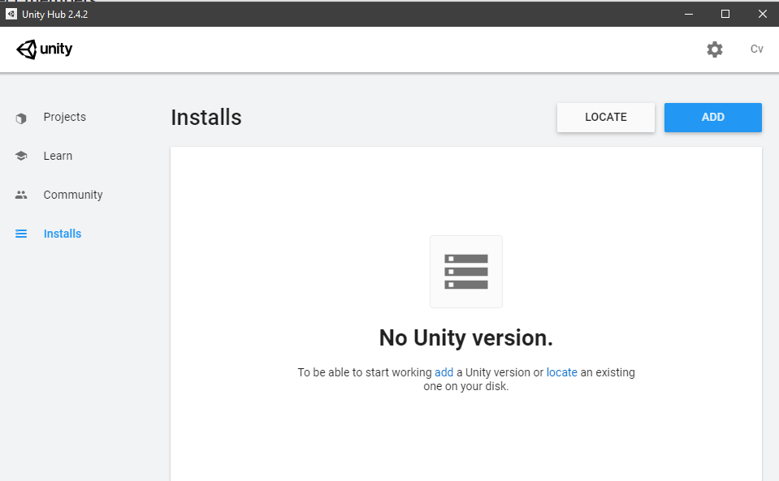
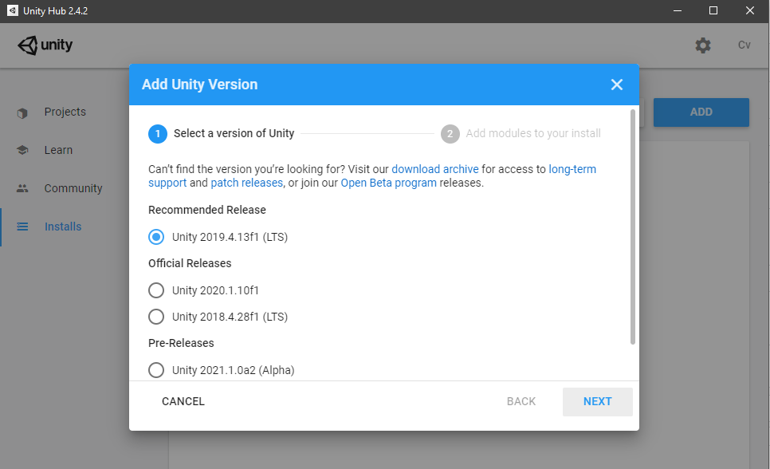
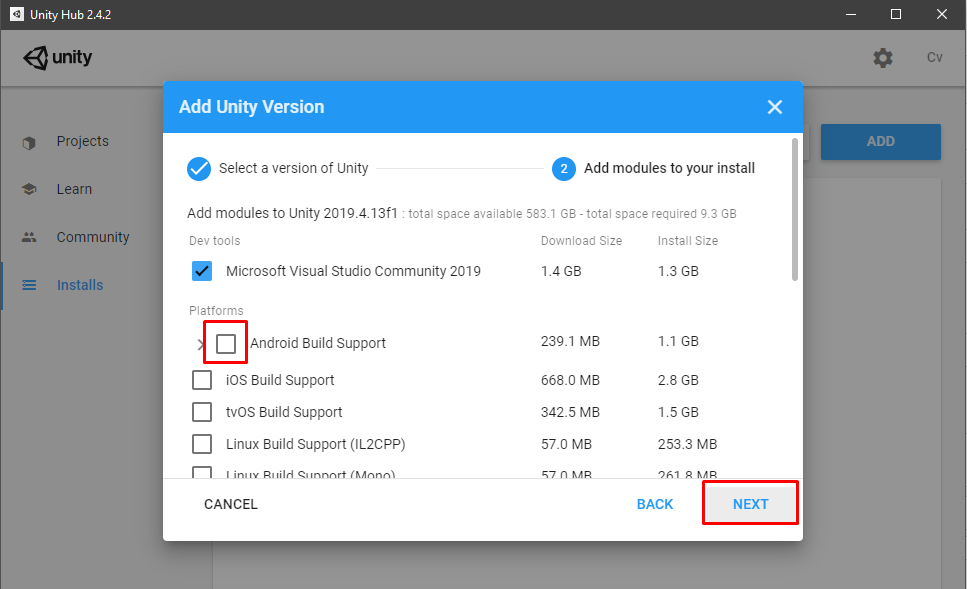
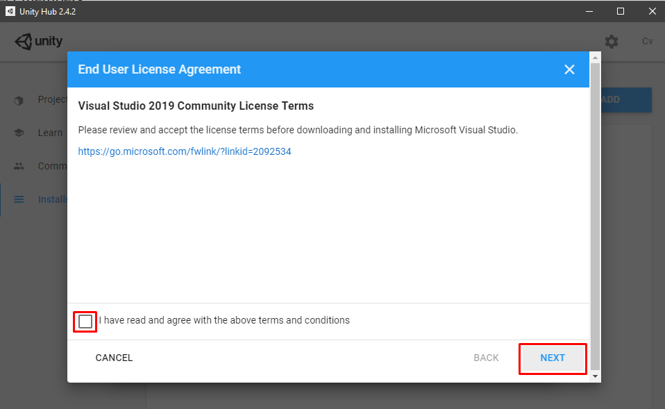
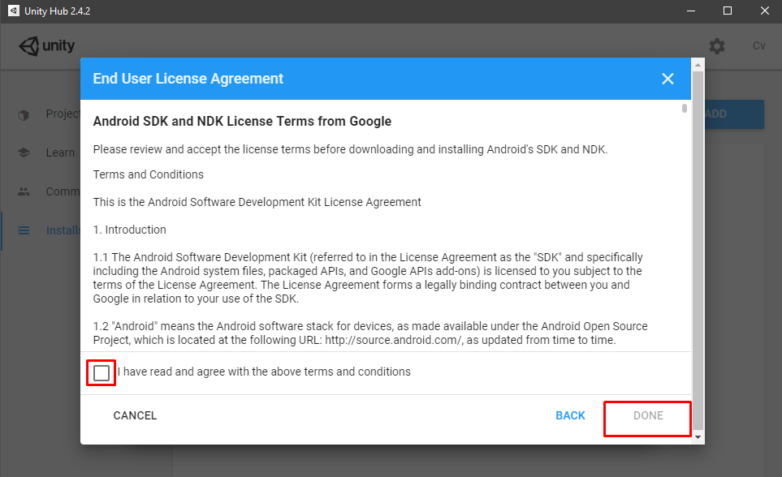

# freetheflurry

## Colaborate?

1) first you will need to download the latest unity client: unity hub 2.4.2 ([link](https://unity3d.com/get-unity/download))

2) once you've installed the unity hub, you will need to install the unity editor by clicking on 'installs' and the on 'ADD'.

3) Afterwards you click on 'NEXT'. Make sure the latest reccomended build is selected.

4) In this window Microsoft Visual studio is already checked. You also have to check the box of 'Android Build Support'. Then click on 'NEXT'.

5) Accept the terms and conditions of visual studio 2019 and click 'NEXT'.

6) Scroll through the terms of Android Build Support en accept them. Then click 'DONE'.

---

**pull or clone this repository and have fun!**